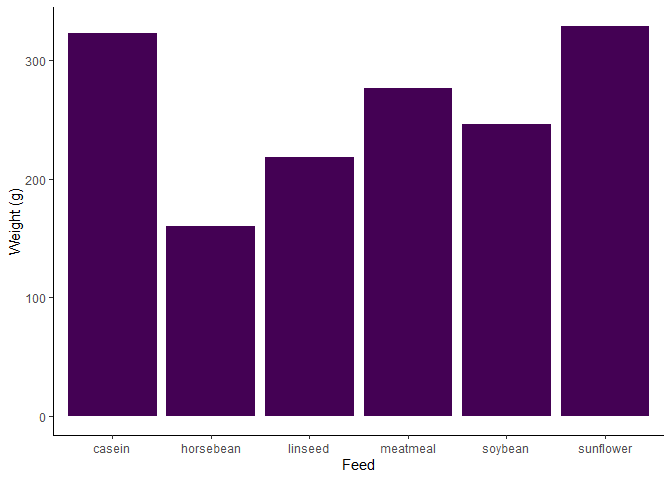

# Load libraries and data


```r
library(magrittr)
```

```
## Warning: package 'magrittr' was built under R version 4.0.3
```

```r
library(kableExtra)
```

```
## Warning: package 'kableExtra' was built under R version 4.0.5
```

```r
library(modelsummary)
library(ggplot2)
df <- chickwts
```

# Table

## Table by kableExtra


```r
# make summary table
table_summary <-
  df %>%
  dplyr::group_by(feed) %>%
  dplyr::summarise(
    N = length(weight),
    mean = mean(weight),
    sd = sd(weight),
    min = min(weight),
    median = median(weight),
    max = max(weight),
    .groups = "drop"
  ) %>%
  dplyr::ungroup() 

# export to html for display
table_summary %>%
  kbl() %>%
  kable_classic()
```

<table class=" lightable-classic" style='font-family: "Arial Narrow", "Source Sans Pro", sans-serif; margin-left: auto; margin-right: auto;'>
 <thead>
  <tr>
   <th style="text-align:left;"> feed </th>
   <th style="text-align:right;"> N </th>
   <th style="text-align:right;"> mean </th>
   <th style="text-align:right;"> sd </th>
   <th style="text-align:right;"> min </th>
   <th style="text-align:right;"> median </th>
   <th style="text-align:right;"> max </th>
  </tr>
 </thead>
<tbody>
  <tr>
   <td style="text-align:left;"> casein </td>
   <td style="text-align:right;"> 12 </td>
   <td style="text-align:right;"> 323.5833 </td>
   <td style="text-align:right;"> 64.43384 </td>
   <td style="text-align:right;"> 216 </td>
   <td style="text-align:right;"> 342.0 </td>
   <td style="text-align:right;"> 404 </td>
  </tr>
  <tr>
   <td style="text-align:left;"> horsebean </td>
   <td style="text-align:right;"> 10 </td>
   <td style="text-align:right;"> 160.2000 </td>
   <td style="text-align:right;"> 38.62584 </td>
   <td style="text-align:right;"> 108 </td>
   <td style="text-align:right;"> 151.5 </td>
   <td style="text-align:right;"> 227 </td>
  </tr>
  <tr>
   <td style="text-align:left;"> linseed </td>
   <td style="text-align:right;"> 12 </td>
   <td style="text-align:right;"> 218.7500 </td>
   <td style="text-align:right;"> 52.23570 </td>
   <td style="text-align:right;"> 141 </td>
   <td style="text-align:right;"> 221.0 </td>
   <td style="text-align:right;"> 309 </td>
  </tr>
  <tr>
   <td style="text-align:left;"> meatmeal </td>
   <td style="text-align:right;"> 11 </td>
   <td style="text-align:right;"> 276.9091 </td>
   <td style="text-align:right;"> 64.90062 </td>
   <td style="text-align:right;"> 153 </td>
   <td style="text-align:right;"> 263.0 </td>
   <td style="text-align:right;"> 380 </td>
  </tr>
  <tr>
   <td style="text-align:left;"> soybean </td>
   <td style="text-align:right;"> 14 </td>
   <td style="text-align:right;"> 246.4286 </td>
   <td style="text-align:right;"> 54.12907 </td>
   <td style="text-align:right;"> 158 </td>
   <td style="text-align:right;"> 248.0 </td>
   <td style="text-align:right;"> 329 </td>
  </tr>
  <tr>
   <td style="text-align:left;"> sunflower </td>
   <td style="text-align:right;"> 12 </td>
   <td style="text-align:right;"> 328.9167 </td>
   <td style="text-align:right;"> 48.83638 </td>
   <td style="text-align:right;"> 226 </td>
   <td style="text-align:right;"> 328.0 </td>
   <td style="text-align:right;"> 423 </td>
  </tr>
</tbody>
</table>

```r
# export to latex for draft
table_summary%>%
  kbl(
    format = "latex",
    booktabs = TRUE
  ) %>%
  save_kable(
    file = here::here("draft/figuretable/tutorial_table_kable.tex")
  )
```
## Regression table by modelsummary


```r
# run a regression
table_regression <-
  df %>%
  lfe::felm(
    data = .,
    formula = weight ~ as.factor(feed)
  )

# export to html for display
table_regression %>%
  modelsummary(
    models = .,
    stars = TRUE
  ) %>%
  kable_classic()
```

<table class="table lightable-classic" style='width: auto !important; margin-left: auto; margin-right: auto; font-family: "Arial Narrow", "Source Sans Pro", sans-serif; margin-left: auto; margin-right: auto;'>
 <thead>
  <tr>
   <th style="text-align:left;">   </th>
   <th style="text-align:center;"> Model 1 </th>
  </tr>
 </thead>
<tbody>
  <tr>
   <td style="text-align:left;"> (Intercept) </td>
   <td style="text-align:center;"> 323.583*** </td>
  </tr>
  <tr>
   <td style="text-align:left;">  </td>
   <td style="text-align:center;"> (15.834) </td>
  </tr>
  <tr>
   <td style="text-align:left;"> as.factor(feed)horsebean </td>
   <td style="text-align:center;"> -163.383*** </td>
  </tr>
  <tr>
   <td style="text-align:left;">  </td>
   <td style="text-align:center;"> (23.485) </td>
  </tr>
  <tr>
   <td style="text-align:left;"> as.factor(feed)linseed </td>
   <td style="text-align:center;"> -104.833*** </td>
  </tr>
  <tr>
   <td style="text-align:left;">  </td>
   <td style="text-align:center;"> (22.393) </td>
  </tr>
  <tr>
   <td style="text-align:left;"> as.factor(feed)meatmeal </td>
   <td style="text-align:center;"> -46.674** </td>
  </tr>
  <tr>
   <td style="text-align:left;">  </td>
   <td style="text-align:center;"> (22.896) </td>
  </tr>
  <tr>
   <td style="text-align:left;"> as.factor(feed)soybean </td>
   <td style="text-align:center;"> -77.155*** </td>
  </tr>
  <tr>
   <td style="text-align:left;">  </td>
   <td style="text-align:center;"> (21.578) </td>
  </tr>
  <tr>
   <td style="text-align:left;"> as.factor(feed)sunflower </td>
   <td style="text-align:center;"> 5.333 </td>
  </tr>
  <tr>
   <td style="text-align:left;box-shadow: 0px 1px">  </td>
   <td style="text-align:center;box-shadow: 0px 1px"> (22.393) </td>
  </tr>
  <tr>
   <td style="text-align:left;"> Num.Obs. </td>
   <td style="text-align:center;"> 71 </td>
  </tr>
  <tr>
   <td style="text-align:left;"> R2 </td>
   <td style="text-align:center;"> 0.542 </td>
  </tr>
  <tr>
   <td style="text-align:left;"> R2 Adj. </td>
   <td style="text-align:center;"> 0.506 </td>
  </tr>
</tbody>
<tfoot>
<tr>
<td style="padding: 0; border:0;" colspan="100%">
<sup></sup> * p &lt; 0.1, ** p &lt; 0.05, *** p &lt; 0.01</td>
</tr>
</tfoot>
</table>

```r
# export to latex for draft
table_regression %>%
  modelsummary(
    models = .,
    stars = TRUE,
    booktabs = TRUE,
    output = "latex_tabular"
  ) %>%
  gsub("\\multicolumn.*\\\\", "", .) %>%
  save_kable(
    file = here::here("draft/figuretable/tutorial_table_modelsummary.tex")
    )
```

# Figure

## Bar plot by ggplot2


```r
# display plot
df %>%
  dplyr::group_by(feed) %>%
  dplyr::summarise(
    mean = mean(weight),
    .groups = "drop"
  ) %>%
  dplyr::mutate(group = "all") %>%
  ggplot(
    aes(
      x = feed,
      y = mean,
      fill = group
    )
  ) +
  geom_bar(
    stat = "identity"
    ) +
  labs(
    x = "Feed",
    y = "Weight (g)"
  ) +
  scale_fill_viridis_d() +
  theme_classic() +
  theme(
    legend.position = "none"
  )
```

<!-- -->

```r
# save
ggsave(
  filename = here::here("draft/figuretable/tutorial_figure_bar_ggplot2.png"),
  width = 4,
  height = 3
)
```

## Error bar plot by ggplot2


```r
# display plot
df %>%
  dplyr::group_by(feed) %>%
  dplyr::summarise(
    mean = mean(weight),
    upper = mean(weight) + sd(weight),
    lower = mean(weight) - sd(weight),
    .groups = "drop"
  ) %>%
  dplyr::mutate(group = "all") %>%
  ggplot(
    aes(
      x = feed,
      y = mean,
      fill = group
    )
  ) +
  geom_bar(
    stat = "identity"
    ) +
  geom_errorbar(
    aes(
      x = feed,
      ymin = lower,
      ymax = upper
    ),
    width = 0.5
  ) +
  scale_fill_viridis_d() +
  theme_classic() +
  theme(
    legend.position = "none"
  )
```

<!-- -->

```r
# save
ggsave(
  filename = here::here("draft/figuretable/tutorial_figure_errorbar_ggplot2.png"),
  width = 4,
  height = 3
)
```

